# PMHub 改善・機能拡充（Drop）マスタードキュメント (DROPS.md)

> 最終更新: 2026-09-19  
> 開発・改善単位の呼称を **「Drop（ドロップ）」** に統一しました。  
> 本ドキュメントは、従来のコードレビューおよび改善計画を一元化し、PMHub の継続的改善ロードマップとして管理するマスタードキュメントです。  
> **【運用指針】今後もすべての Drop は構想段階（計画前）の時点で本ドキュメントに背景・狙い・技術仕様を先行記載し、プロジェクト全体の進化ロードマップを可視化・共有します。**

---

## 1. クロールルール & エンジン改革サマリー

### 改革前の課題と到達成果
- **以前の課題**:
  - 全 1,505 会議体のクロール成否が `partial`（23.6%）・`failed`（18.7%）と計 42.4% が不完全・失敗状態。
  - スキップリンク誤判定による本文消失、探索上限 `[:6]` による最新回切り捨て、403 WAF 遮断多発。
  - 親テーブル型会議体（202件）で `extract_from_parent_table: true` が未実装。
  - 孤立ルール（41件）の残存、形骸化フラグ（927件）の散乱、未設定会議体（250件）の放置。
  - サブページ探索上限（25件）による未登録過去回の取りこぼしと、既登録回への重複再アクセスによる無駄なHTTP負荷。
- **Drop 10 〜 16 による抜本的解決**:
  - **Drop 10**: スキップリンク誤判定防止（CR-1）、最新優先ソート＆最大25件探索（CR-2）、投機的アクセス廃止＆403回避（CR-3）、ジェネリック小見出し除外強化（CR-4）
  - **Drop 11**: 親ページ直結テーブル解析エンジン新設（CR-5）、親テーブル開催回・配付資料の同期連携統合（CR-6）
  - **Drop 12**: 孤立ルール41件の削除＆形骸化フラグ927件一掃（CR-7）、標準テンプレート集約＆ネスト辞書自動展開（CR-8）、未設定250件へのテンプレート付与による **全1,505会議体 100% ルール適用達成**（CR-9）
  - **Drop 13**: スマート差分探索エンジン（Smart Incremental Crawl）の実装（CR-10, CR-11）。既登録開催回の探索スキップ、直近最新1〜2回の更新確認維持、未登録開催回の探索枠最大50件拡大を両立。
  - **Drop 14**: クロール成否判定の厳格化とデータ品質ガード（CR-12, CR-13）。成否判定エンジン `determine_crawl_result` の新設、プレースホルダー日付（2099/01/01）の検知・要確認集計アラート機構。
  - **Drop 15**: クロール網羅性・品質向上エンジン（CR-14〜CR-17）。親ページ実リンク解析型サブページ探索（投機的類推排除）、2段階目URL（`archiveUrl`）の保持と起点探索連携、URL日付抽出フォールバック、ポータル目次ゴミ会議体の自動整理。
  - **Drop 16（構想中）**: クロール堅牢化 & 共通ナビ・常設資料誤検知排除エンジン（CR-18〜CR-22）。Windows stdoutバッファ例外防止（Errno 22根絶）、省庁共通ナビ・広報リンク誤登録遮断、組織常設資料（設置要綱等）の開催回誤登録防止、ホスト名単位の巡回分散、既存データの完全クリーンアップ。

---

## 2. 実施ロードマップ（Drop 10 〜 19）

```mermaid
flowchart TD
    subgraph Drop10["【完了】Drop 10: クローラー基盤の重大バグ修正・誤判定防止"]
        J1["CR-1: clean_html_for_dates のスキップリンク誤認識バグ修正 [完了]"]
        J2["CR-2: サブページ探索上限 [:6] 撤廃と最新順優先ソート [完了]"]
        J3["CR-3: 随伴資料探索の過剰アクセス是正（403 回避） [完了]"]
        J4["CR-4: extract_page_title のジェネリック見出し除外強化 [完了]"]
    end

    subgraph Drop11["【完了】Drop 11: 親ページ直結型（テーブル/リスト型）抽出エンジンの実装"]
        K1["CR-5: 親ページ内テーブル/リスト解析エンジンの新設（extract_from_parent_table 実効化） [完了]"]
        K2["CR-6: sync_new_meetings_from_crawl の親ページ開催回同期統合 [完了]"]
    end

    subgraph Drop12["【完了】Drop 12: スクレイピングルール（scrapingRules）の再編・標準化"]
        L1["CR-7: 孤立ルール（41件）の安全削除 & 形骸化フラグ整理 [完了]"]
        L2["CR-8: 個別ルールの標準テンプレート集約 & ネスト辞書フラット化 [完了]"]
        L3["CR-9: 未設定 250 会議体へのルール適用（100% カバレッジ達成） [完了]"]
    end

    subgraph Drop13["【完了】Drop 13: スマート差分探索エンジン（Smart Incremental Crawl）"]
        M1["CR-10: 差分判定エンジン _filter_incremental_subpages の新設 [完了]"]
        M2["CR-11: _crawl_subpages & run_meeting_crawler への差分巡回統合 [完了]"]
    end

    subgraph Drop14["【完了】Drop 14: クロール成否判定の厳格化とデータ品質ガード"]
        N1["CR-12: 資料件数・日付・タイトルの整合性による成否（success/partial/failed）自動判定精緻化 [完了]"]
        N2["CR-13: プレースホルダー日付（2099/01/01）の自動検知・アラート機構 [完了]"]
    end

    subgraph Drop15["【完了】Drop 15: クロール網羅性・品質向上エンジン"]
        O1["CR-14: 親ページ実リンク解析型 サブページ探索エンジン（投機的類推排除） [完了]"]
        O2["CR-15: 2段階目URL（archiveUrl）の保持と起点探索エンジン [完了]"]
        O3["CR-16: URL日付抽出フォールバック & partial 解消 [完了]"]
        O4["CR-17: マスターデータ健全化・ポータル目次ゴミ会議体の自動整理 [完了]"]
    end

    subgraph Drop16["【構想】Drop 16: クロール堅牢化 & 共通ナビ・常設資料誤検知排除エンジン"]
        P1["CR-18: Windows stdout 出力安全ガード & Errno 22 根絶"]
        P2["CR-19: 共通ナビ・広報リンク誤登録遮断ガード"]
        P3["CR-20: 組織常設資料（設置要綱・委員名簿）の開催回誤登録防止"]
        P4["CR-21: ホスト名ベース巡回インターリーブ & METI/ANRE 連続アクセス防止"]
        P5["CR-22: 既存データ内共通ナビ・常設資料ゴミ開催回の全件クリーンアップ"]
    end

    subgraph Drop17["【構想】Drop 17: 配付資料テキスト（PDF/HTML）自動抽出パイプライン & 全文検索インデックス基盤"]
        Q1["CR-23: PDF/HTML 配付資料テキスト抽出エンジン（軽量・安全キャップ付き）"]
        Q2["CR-24: 議題・キーフレーズ自動タグ付けと軽量検索インデックス生成"]
        Q3["CR-25: 配付資料キャッシュとオンデマンド抽出パイプライン（直近1年重点）"]
    end

    subgraph Drop18["【構想】Drop 18: 会議体メタデータ拡充 & 省庁横断政策テーマ連携"]
        R1["CR-26: 親組織・分科会・部会・WGの階層構造化とオントロジー定義"]
        R2["CR-27: 省庁横断政策テーマ（AI・GX・少子化・防災等）タグ連携"]
    end

    subgraph Drop19["【構想】Drop 19: 公開ポータル高度検索 & アラート通知基盤"]
        S1["CR-28: 会議体・キーワード別新着アラート（RSS/Webhook/ウォッチリスト）"]
        S2["CR-29: 高度絞り込みUI（資料テキスト全文検索・複数省庁横断比較）"]
    end

    Drop10 --> Drop11 --> Drop12 --> Drop13 --> Drop14 --> Drop15 --> Drop16 --> Drop17 --> Drop18 --> Drop19
```

---

## 3. クローラー関連 Drop 詳細一覧

### 【Drop 15】クロール網羅性・品質向上エンジン（全4件・完了）

| ID | 分類 | 内容 | 対象ファイル | 完了日 |
|:---|:---:|:---|:---|:---:|
| **CR-14** | 探索エンジン | **親ページ実リンク解析型 サブページ探索エンジン** URLの投機的推測アクセスを完全排除。親会議体URLのHTML内に実在する正規リンク（`<a>`タグ）を走査し、アンカーテキスト（「第X回」「開催」「日付」等）や親ページの文脈から開催回サブページを確実に判定・取得 | `admin/crawler.py` | 2026-09-19 |
| **CR-15** | データ & 探索 | **2段階目URL（`archiveUrl`）の保持と起点探索エンジン** トップページと開催回一覧ページが分かれている会議体（例: CAO男女共同参画会議等）について、`docs/data.json` の `councils` レコードに `archiveUrl` を保持し、クローラーはそのURLを起点として開催回情報を探索 | `docs/data.json` `admin/crawler.py` | 2026-09-19 |
| **CR-16** | 日付復元 | **URL日付抽出フォールバック & partial 解消** 本文から開催日が取得できない場合でも、正規リンクURL内の日付情報（`YYYYMMDD`, `YYYY-MM-DD`, 和暦等）から自動復元し、正常な開催回として昇格（「資料あり / 日付0件」の解消） | `admin/crawler.py` | 2026-09-19 |
| **CR-17** | マスター健全化 | **マスターデータ健全化・ポータル目次ゴミ会議体の自動整理** 省庁ポータルの目次・共通ナビ（MOJ/ANRE等の10件）を安全に `rejected_councils.json` へ移行・除外。`is_generic_index_url` を強化し再混入を防止 | `admin/crawler.py` `docs/data.json` `docs/rejected_councils.json` | 2026-09-19 |

---

### 【Drop 16】クロール堅牢化 & 共通ナビ・常設資料誤検知排除エンジン（全5件・構想）

| ID | 分類 | 内容 | 対象ファイル | 状態 |
|:---|:---:|:---|:---|:---:|
| **CR-18** | エンジン堅牢化 | **Windows stdout 出力安全ガード & `Errno 22` 根絶** `emit()` 内の生 `print(msg)` を `try...except OSError` で安全保護し、Windows C ランタイムが標準出力バッファ競合時や絵文字・特殊記号出力時に `[Errno 22] Invalid argument` をスローしてクロール処理が `UNEXPECTED ERROR`（failed）として中断・誤失敗する問題を根本撲滅 | `admin/crawler.py` | 構想中 |
| **CR-19** | 誤検知排除 | **共通ナビ・広報リンク誤登録遮断ガード** Drop 15 の実リンク解析で発生した省庁共通ナビゲーション・広報リンク（「報道・広報」「関連リンク」「災害への対応」「施策紹介」「最近の話題」「オンライン利用率引上げ」「調査の概要」等）の「開催回」誤登録を確実に遮断する除外キーワード辞書およびセレクタ強化を実装 | `admin/crawler.py` | 構想中 |
| **CR-20** | 資料分離 | **組織常設資料（設置要綱・委員名簿）の開催回誤登録防止** 「設置要綱」「要領」「委員名簿」「根拠法令」等の組織常設資料（会議体資料）が、日付不明（`2099/01/01`）や臨時回次（`s04`, `s05` 等）として個別の開催回（meetings）に重複登録されるのを遮断 | `admin/crawler.py` | 構想中 |
| **CR-21** | WAF回避 | **ホスト名ベース巡回インターリーブ & METI/ANRE 連続アクセス防止** 同一省庁だけでなく同一ホスト名（ドメイン）単位で巡回順序を均等分散するアルゴリズムを導入。同一ドメイン（`www.meti.go.jp`）である METI（経済産業省）と ANRE（資源エネルギー庁）の連続アクセスによる Akamai WAF 遮断（空タイトル FAILED）を根本回避 | `admin/crawler.py` | 構想中 |
| **CR-22** | データ健全化 | **既存データ内共通ナビ・常設資料ゴミ開催回の全件クリーンアップ** 現行 `docs/data.json` 内に混入している共通ナビ・広報リンク・設置要綱等のゴミ開催回（約106件）を全件スキャンして安全に一括削除・整理し、マスターデータの完全整合性を回復 | `docs/data.json` `admin/cleanup_nav_meetings.py` | 構想中 |

---

### 【Drop 17】配付資料テキスト（PDF/HTML）自動抽出パイプライン & 全文検索インデックス基盤（構想）

| ID | 分類 | 内容 | 対象ファイル | 状態 |
|:---|:---:|:---|:---|:---:|
| **CR-23** | テキスト抽出 | **PDF/HTML 配付資料テキスト抽出エンジン（`extract_material_text.py`）** 配付資料（PDF/HTML）から本文テキストを軽量・安全に抽出するパーサーを実装。全件一括の過大負荷を避けるため、先頭ページ（議事次第・要旨等）を重点抽出し、最大文字数キャップを設けてメモリ消費・処理時間を抑制 | `admin/extract_material_text.py` `admin/crawler.py` | 構想中 |
| **CR-24** | 検索インデックス | **議題・キーフレーズ自動タグ付けと軽量検索インデックス生成** 抽出された資料テキストから主要行政キーワード・政策用語を抽出し、会議レコードの `tags` や `summary` を補強。フロントエンド用軽量インデックスを整備 | `admin/build_search_index.py` `docs/app.js` | 構想中 |
| **CR-25** | パイプライン | **配付資料キャッシュとオンデマンド抽出パイプライン** 新着開催回および直近1年間の活発な会議体から段階的に抽出・蓄積する差分キャッシュ機構を整備。ネットワーク遮断時や再クロール時の再ダウンロードを抑止 | `admin/crawler.py` `admin/material_cache.py` | 構想中 |

---

### 【Drop 14】クロール成否判定の厳格化とデータ品質ガード（全2件・完了）

| ID | 分類 | 内容 | 対象ファイル | 完了日 |
|:---|:---:|:---|:---|:---:|
| **CR-12** | 品質判定 | **クロール成否（success/partial/failed）自動判定の精緻化 & 判定理由記録** 単なる「資料件数>0 かつ 日付件数>0」による形式的 success 判定を廃止。PDF資料の有無、実在開催日（2099ダミー除く）、タイトル品質（ジェネリック見出し除外）、開催回データ（`subpageMeetings`）の有無を総合評価する判定エンジン `determine_crawl_result` を新設し、判定理由（`resultReason`）を記録 | `admin/crawler.py` | 2026-09-19 |
| **CR-13** | アラート機構 | **プレースホルダー日付（2099/01/01）の自動検知・アラート機構** 開催日未取得時のダミー日付（`2099/01/01` / `isDateUnconfirmed: True`）を自動検知・集計するヘルパー `get_unconfirmed_meetings_count` を新設。クローラー実行サマリーおよび管理サーバー API（`/api/status`）に要確認件数のアラート出力を追加 | `admin/crawler.py` `admin/server.py` `testing/test_crawler_quality.py` `testing/smoke_test.py` | 2026-09-19 |

---

### 【Drop 13】スマート差分探索エンジン（全2件・完了）

| ID | 分類 | 内容 | 対象ファイル | 完了日 |
|:---|:---:|:---|:---|:---:|
| **CR-10** | 性能・効率 | **差分判定エンジン `_filter_incremental_subpages` の新設** 候補サブページ群と既登録開催回URL（`meetings.officialUrl`）を照合し、「未登録サブページ（最大50件）」「更新確認サブページ（最新2件）」「既登録スキップ対象」に高速分類する判定ロジックを実装。URLのプロトコルや末尾スラッシュのゆらぎを自動正規化 | `admin/crawler.py` | 2026-09-19 |
| **CR-11** | 統合・安全 | **`_crawl_subpages` および `run_meeting_crawler` への差分巡回統合** `run_meeting_crawler` で会議体ごとの既登録URLセットを事前生成して連携。既登録の過去回への不要なHTTPアクセスを遮断しつつ、未登録回の探索枠を25件から50件へと倍増。WAF 403 遮断を完全抑止しながら網羅性を大幅向上 | `admin/crawler.py` `testing/test_crawler_incremental.py` `testing/smoke_test.py` | 2026-09-19 |

---

### 【Drop 12】スクレイピングルール（`scrapingRules`）の再編・標準化（全3件・完了）

| ID | 分類 | 内容 | 対象ファイル | 完了日 |
|:---|:---:|:---|:---|:---:|
| **CR-7** | 整合性 | **孤立ルール（41件）の削除 & 形骸化フラグのクリーンアップ** 存在しない旧会議体IDを指す孤立ルール（41件）を安全に削除。常時ディープクロール化に伴い形骸化した `deep_crawl_enabled`（927件）を一掃 | `docs/data.json` `admin/crawler.py` | 2026-09-19 |
| **CR-8** | 保守性 | **個別ルールの標準テンプレート集約 & ネスト辞書フラット化** `load_scraping_rules()` でネストされた `rules` 辞書を自動展開。5大標準テンプレート（`tpl-general-round-subpage` 等）へルールを集約 | `admin/crawler.py` `docs/data.json` | 2026-09-19 |
| **CR-9** | カバレッジ | **ルール未設定（250会議体）へのルール適用（100% 達成）** FDMA（74件）、FSA（41件）、MHLW（35件）等の未設定会議体にテンプレートを割り当て、全 1,505 会議体に対するルール定義率 100% を達成 | `docs/data.json` | 2026-09-19 |

---

### 【Drop 11】親ページ直結型（テーブル/リスト型）抽出エンジンの実装（全2件・完了）

| ID | 分類 | 内容 | 対象ファイル | 完了日 |
|:---|:---:|:---|:---|:---:|
| **CR-5** | 新機能 | **親ページ内テーブル/リスト解析処理の実装** 202 会議体に設定された `extract_from_parent_table: true` を実効化。親ページの `<table>` から「回次・開催日・配付資料リスト」を行単位で一体抽出するエンジン `_extract_meetings_from_parent_table` を追加 | `admin/crawler.py` | 2026-09-19 |
| **CR-6** | 連動統合 | **`sync_new_meetings_from_crawl` の親ページ開催回同期対応** `execute_rule_retrieval` で親テーブル開催回を `subpage_meetings`・資料リスト・日付リストへ統合。同一URLによる一律スキップを解除し、回次・日付ベースの重複排除と既存会議への個別資料昇格をサポート | `admin/crawler.py` | 2026-09-19 |

---

### 【Drop 10】クローラー基盤の重大バグ修正・誤判定防止（全4件・完了）

| ID | 分類 | 内容 | 対象ファイル | 完了日 |
|:---|:---:|:---|:---|:---:|
| **CR-1** | バグ修正 | `clean_html_for_dates` のスキップリンク誤認識バグ修正（ブロックコンテナ限定・インライン除去） | `admin/crawler.py` | 2026-09-19 |
| **CR-2** | 構造改善 | サブページ探索上限 `[:6]` 撤廃・最新優先ソート・親一覧除外 | `admin/crawler.py` | 2026-09-19 |
| **CR-3** | 安定性 | 随伴資料探索の過剰アクセス是正（403 回避・ページ内アンカー限定・レートリミット遵守） | `admin/crawler.py` | 2026-09-19 |
| **CR-4** | 品質向上 | `extract_page_title` のジェネリック小見出し除外強化（小見出しスキップ・タイトル補正） | `admin/crawler.py` | 2026-09-19 |

---

## 4. アーカイブ：実装済み一覧（全61件・Drop 1 〜 14 完了）

Drop 1 〜 14 で完了した全61件のリファクタリング一覧（クリックで開閉）

| ID | Drop | 分類 | 内容 | 対象ファイル | 完了日 |
|:---|:---:|:---:|:---|:---|:---:|
| **CR-12** | **Drop 14** | 品質判定 | クロール成否判定（success/partial/failed）自動判定の精緻化 & 判定理由（resultReason）記録 | `admin/crawler.py` | 2026-09-19 |
| **CR-13** | **Drop 14** | アラート機構 | プレースホルダー日付（2099/01/01）の自動検知・集計・要確認アラート機構 & API 連携 | `admin/crawler.py` `admin/server.py` `testing/test_crawler_quality.py` | 2026-09-19 |
| **CR-10** | **Drop 13** | 性能・効率 | 差分判定エンジン `_filter_incremental_subpages`（既登録スキップ・最新2件更新確認・未登録最大50件枠） | `admin/crawler.py` | 2026-09-19 |
| **CR-11** | **Drop 13** | 統合・安全 | `_crawl_subpages` および `run_meeting_crawler` への差分巡回統合 & 全13大テスト連携 | `admin/crawler.py` `testing/test_crawler_incremental.py` `testing/smoke_test.py` | 2026-09-19 |
| **CR-7** | **Drop 12** | 整合性 | 孤立ルール（41件）の削除 & 形骸化フラグ（927件）のクリーンアップ | `docs/data.json` | 2026-09-19 |
| **CR-8** | **Drop 12** | 保守性 | 個別ルールの標準テンプレート集約 & `load_scraping_rules()` ネスト辞書フラット化 | `admin/crawler.py` `docs/data.json` | 2026-09-19 |
| **CR-9** | **Drop 12** | カバレッジ | ルール未設定（250会議体）へのルール適用（全1,505会議体 100% カバレッジ達成） | `docs/data.json` | 2026-09-19 |
| **CR-5** | **Drop 11** | 新機能 | 親ページ内テーブル/リスト解析処理の実装（テーブル行からの回次・日付・資料一体抽出パーサー） | `admin/crawler.py` | 2026-09-19 |
| **CR-6** | **Drop 11** | 連動統合 | `sync_new_meetings_from_crawl` の親ページ開催回同期対応（単一ページ型会議体の自動検知・資料昇格） | `admin/crawler.py` | 2026-09-19 |
| **CR-1** | **Drop 10** | バグ修正 | `clean_html_for_dates` のスキップリンク誤認識バグ修正（ブロックコンテナ限定・インライン除去） | `admin/crawler.py` | 2026-09-19 |
| **CR-2** | **Drop 10** | 構造改善 | サブページ探索上限 `[:6]` 撤廃・最新優先ソート・親一覧除外 | `admin/crawler.py` | 2026-09-19 |
| **CR-3** | **Drop 10** | 安定性 | 随伴資料探索の過剰アクセス是正（403 回避・ページ内アンカー限定・レートリミット遵守） | `admin/crawler.py` | 2026-09-19 |
| **CR-4** | **Drop 10** | 品質向上 | `extract_page_title` のジェネリック小見出し除外強化（小見出しスキップ・タイトル補正） | `admin/crawler.py` | 2026-09-19 |
| **F-8** | **Drop 9** | パフォーマンス | 会議データ管理（TAB 2）の 10,041 件一括全描画をオンデマンド・スクロール追記（初回100件）へ最適化。DOM サイズを 59.4MB $\to$ 507KB（99.1%削減）にしフリーズ根絶 | `admin/admin_dashboard.html` | 2026-09-18 |
| **F-7** | **Drop 9** | ユーザー体験 | 会議体名入力補完コンボボックス化 & 同期直後の差分ハイライト表示 | `admin/admin_dashboard.html` | 2026-09-18 |
| **F-6** | **Drop 9** | 堅牢性 | 会議追加・更新モーダルのバリデーション強化（日付8桁・ID体系チェック） | `admin/admin_dashboard.html` | 2026-09-18 |
| **F-5** | **Drop 9** | 保守性 | 管理コンソール JS の疎結合モジュール化（`admin_state.js`, `admin_api.js`, `admin_render.js`） | `admin/` | 2026-09-18 |
| **F-4** | **Drop 8** | 安全性 | 手動編集データ保護フラグ（`manualLock: true`）の導入 & クローラー再配分・除外ガード | `admin/crawler.py` `admin/apply_report.py` | 2026-09-18 |
| **F-3** | **Drop 8** | 信頼性 | プレースホルダー日付（`2099/01/01`）のダミー判定と当日日付自動設定の禁止 | `admin/crawler.py` | 2026-09-18 |
| **F-2** | **Drop 8** | 品質 | 配付資料からの UI 操作リンク・スキップリンク（`#contents` 等）の厳格フィルタリング | `admin/crawler.py` | 2026-09-18 |
| **F-1** | **Drop 8** | データ整合 | ジェネリックタイトル（「会議資料詳細」等）の本文見出し・正規化タイトル補正 | `admin/crawler.py` | 2026-09-18 |
| **E-1〜E-10** | **Drop 5〜7** | 整合・移行 | 会議体・開催回・資料のID体系正規化、重複排除、データクレンジング（全10件） | `docs/data.json` 等 | 2026-09-17 |
| **D-1〜D-10** | **Drop 4** | アーキテクチャ | 検索インデックス事前生成、UIアクセシビリティ、セキュリティサニタイズ（全10件） | `docs/app.js` 等 | 2026-09-16 |
| **C-1〜C-10** | **Drop 3** | 最適化 | クローラーのレートリミット（0.35s）、User-Agent偽装回避、エンコーディング判定（全10件） | `admin/crawler.py` 等 | 2026-09-15 |
| **B-1〜B-5** | **Drop 2** | テスト基盤 | 統合テストスイート（smoke_test.py）の構築、JSランタイムテスト新設（全5件） | `testing/` | 2026-09-14 |
| **A-1〜A-5** | **Drop 1** | 初期基盤 | 会議体ID・開催回IDのハイフン規則定義、Gitブランチ運用ルールの確立（全5件） | 全体 | 2026-09-13 |

