# PMHub 改善・機能拡充（Drop）マスタードキュメント (DROPS.md)

> 最終更新: 2026-09-25  
> 開発・改善単位の呼称を **「Drop（ドロップ）」** に統一しています。  
> 本ドキュメントは、従来のコードレビューおよび改善計画を一元化し、PMHub の継続的改善ロードマップおよび実施記録を一元管理するマスタードキュメントです。  
> **【運用指針】今後もすべての Drop は構想段階（計画前）の時点で本ドキュメントに背景・狙い・技術仕様を先行記載し、プロジェクト全体の進化ロードマップを可視化・共有します。**

---

## 1. クロールルール & エンジン改革サマリー

### 1-1. クロール成功率向上ロードマップ（施策ステップと到達予測）

クローラーの成否ステータス（`success` / `partial` / `failed`）を分析し、目標成功率 **85% 〜 90% 超・95% 超** の達成に向けた段階的施策ステップです。

| 施策ステップ | 主な対象 | 期待される成功数 | 予測クロール成功率 | 対応 Drop | ステータス |
|:---|:---|:---:|:---:|:---:|:---:|
| **基準点** | クロール初期状態 | 999 件 | 67.0% (999 / 1,490件) | - | 完了 |
| **ステップ 1** | **施策 1 (METI/ANRE ルール整備 & 重複統合)** METI/ANRE 重複会議体44ペア（88件）をANRE側へ集約統合、全80会議体に標準ルール適用、金融庁（FSA）49会議体100%成功転換 | **+51 件** | **72.6%** (1,050 / 1,446件) | **Drop 19** | **【完了】** |
| **ステップ 2** | **施策 2 (サブページ深掘り & 残存PARTIAL完全解消)** 内閣官房の本文消失バグ修正、財務省2段階構造archiveUrl化、総務省・デジタル庁・財務省固有サブページ正規表現拡充、ルール内href一掃 | **+98 件** | **79.39%** (1,148 / 1,446件) | **Drop 20** | **【完了】** |
| **ステップ 3** | **施策 4 (主要5省庁 404 URL 修復 & WAF遮断・マスター適正化)** MEXT, MLIT, MHLW, MOJ, MIC の新URL調査適用（19件成功昇格・307開催回・842資料同期）、AWS WAF チャレンジ画面遮断、常設資料除外ガード | **+19 件** | **80.71%** (1,167 / 1,446件) | **Drop 21** | **【完了】** |
| **品質向上** | **施策 5 (康煕部首・異体字 NFKC 正規化 & 検索表記揺れ完全根絶)** 全会議体・開催回・資料の康煕部首（72箇所）・CJK部首補助を標準漢字へ完全正規化、クローラー常時自動正規化、公開ポータル表記揺れ吸収（※CR-45は除外） | **データ品質大幅向上** | **高精度・ノイズゼロ** （康煕部首0件・検索漏れ完全撲滅） | **Drop 22** | **【完了】** |
| **ステップ 4** | **施策 6 (METI/ANRE/SMEA AWS WAF 突破 & クロール同期)** AWS WAF/CloudFront HTTP 202 チャレンジ自動解決セッションブリッジ、同一ホスト動的スロットリング、84会議体の一括クロール同期 | **+83 件** | **86.51%** (1,251 / 1,446件) | **Drop 23** | **【完了】** |
| **ステップ 5** | **施策 7 (MHLW Partial 30件解消 & CAO/CAS 構造改革・目標90%突破)** 厚労省配付資料セレクター適合 & 別ページ追跡、内閣府・内閣官房の404 URL修復（31件）、親テーブル抽出（38件）適用 & archiveUrl起点化 | **+60 件** | **90.66%** (1,311 / 1,446件) （※目標90%超達成） | **Drop 24** | **【完了】** |
| **ステップ 6** | **施策 8 (農水省系・防衛省・原子力規制委・財務省残存のルール最適化)** 防衛省テーブル解析、原子力規制委の固定一覧URL適正化、農水省系（MAFF/JFA/RINYA）年度別ディレクトリ包括、財務省残存11件のarchiveUrl化 | **+53 件** | **95.85%** (1,386 / 1,446件) （※95%超高精度達成） | **Drop 25** | **【構想】** |
| **完全救済** | **施策 9 (WARP 国会図書館アーカイブ救済 & 廃止マスター適正化)** 完全消滅過去会議体の国会図書館インターネット資料収集保存事業（WARP）自動フォールバック探索、廃止会議体フラグ管理（※Wayback Machine完全不採用） | **約 +40〜60 件** | **98% 〜 100% 到達** | **Drop 26** | **【将来構想】** |

---

### 1-2. 改革前の課題と到達成果
- **以前の課題**:
  - 全 1,505 会議体のクロール成否が `partial`（23.6%）・`failed`（18.7%）と計 42.4% が不完全・失敗状態。
  - スキップリンク誤判定による本文消失、探索上限 `[:6]` による最新回切り捨て、403 WAF 遮断多発。
  - 親テーブル型会議体（202件）で `extract_from_parent_table: true` が未実装。
  - 孤立ルール（41件）の残存、形骸化フラグ（927件）の散乱、未設定会議体（250件）の放置。
  - サブページ探索上限（25件）による未登録過去回の取りこぼしと、既登録回への重複再アクセスによる無駄なHTTP負荷。
- **Drop 10 〜 23 による抜本的解決**:
  - **Drop 10**: スキップリンク誤判定防止（CR-1）、最新優先ソート＆最大25件探索（CR-2）、随伴資料探索の過剰アクセス是正（CR-3）、ジェネリック見出し除外強化（CR-4）
  - **Drop 11**: 親ページ直結テーブル解析エンジン新設（CR-5）、親テーブル開催回・配付資料の同期連携統合（CR-6）
  - **Drop 12**: 孤立ルール41件の削除＆形骸化フラグ927件一掃（CR-7）、標準テンプレート集約＆ネスト辞書自動展開（CR-8）、未設定250件へのテンプレート付与による **全会議体 100% ルール適用達成**（CR-9）
  - **Drop 13**: スマート差分探索エンジン（Smart Incremental Crawl）の実装（CR-10, CR-11）。既登録開催回の探索スキップ、直近最新1〜2回の更新確認維持、未登録開催回の探索枠最大50件拡大を両立。
  - **Drop 14**: クロール成否判定の厳格化とデータ品質ガード（CR-12, CR-13）。成否判定エンジン `determine_crawl_result` の新設、プレースホルダー日付（2099/01/01）の検知・要確認集計アラート機構。
  - **Drop 15**: クロール網羅性・品質向上エンジン（CR-14〜CR-17）。親ページ実リンク解析型サブページ探索、2段階目URL（`archiveUrl`）の保持と起点探索連携、URL日付抽出フォールバック、ポータル目次ゴミ会議体の自動整理。
  - **Drop 16**: クロール堅牢化 & 共通ナビ・常設資料誤検知排除エンジン（CR-18〜CR-22）。Windows stdout安全保護（Errno 22根絶）、共通ナビ除外、組織常設資料（設置要綱等）の除外、ホスト分散インターリーブ巡回。
  - **Drop 17**: クロール超高速化 & 直近アクティブ重点化エンジン（CR-23〜CR-27）。直近2年重点化・休眠スキップ、過去回再検査ゼロ化、廃止会議体フラグ化、並行クロール基盤。
  - **Drop 18**: クロール品質再発防止ガード強化 & 開催案内・非会議データクリーンアップ（CR-28〜CR-32）。`is_preliminary_notice_page` バグ修正、`clean_meeting_title` 新設、年次ディレクトリ誤マッチ排除、受入遮断ガード、データ479件クリーンアップ。
  - **Drop 19**: クローラー精度飛躍的向上 & METI/ANRE重複統合・FSA同期（CR-33〜CR-37）。スマートタイトル抽出（ノイズ見出し除外・本文優先・親アンカー復元）、固有URLアンカー保護＆報告書公表ページ除外、METI/ANRE 重複44ペア完全統合、FSA 49会議体100%成功転換、日付抽出タプルバグ修正。**成功数 1,050件（72.6%）達成**。
  - **Drop 20**: サブページ探索深掘り & 残存PARTIAL完全解消エンジン（CR-38〜CR-41）。`<body id="header">` 破壊ガード、財務省 16 会議体 archiveUrl 起点化、総務省・財務省・デジタル庁サブページパターン拡張、ルール正規表現一括クリーンアップ。**成功数 1,148件（79.39%）・PARTIAL半減（94件）達成**。
  - **Drop 21**: 主要5省庁 404 URL 大規模修復 & AWS WAF 検知遮断・マスター適正化（CR-42〜CR-44）。主要5省庁（MEXT, MLIT, MHLW, MOJ, MIC）新公式URL適用（19件成功昇格・307開催回・842資料同期）、AWS WAF チャレンジ画面検知・遮断ガード新設、組織常設資料再混入防止ガード・ジェネリックタイトル適正是正。**成功数 1,167件（80.71%）到達**。
  - **Drop 22**: 康煕部首文字正規化 & 表記揺れ解消・検索連携（CR-46〜CR-47）。康煕部首（72箇所）・CJK部首補助（3箇所）の完全根絶（0件）、クローラー抽出処理への常時 NFKC 正規化組み込み、全 1,446 会議体・15,365 開催回・91,933 配付資料に対する 6.2 万箇所の一括バッチ正規化、公開ポータル（`docs/app.js`）検索インデックス連携による全角英数・異体字の表記揺れ完全吸収。**クロール成功数 1,168件（80.77%）**。
  - **Drop 23**: METI / ANRE / SMEA AWS WAF 突破 & クロール同期（CR-48〜CR-50）。HTTP 202（AWS WAF Challenge）自動検知バックオフリトライ機構（CR-48）、経産省系ドメイン別動的レートリミット（CR-49）、全 84 会議体の公式 URL 是正 & 開催回・配付資料網羅同期（CR-50）。新規開催回 721 件追加、既存開催回 32 件更新（総開催回数 16,086 件）。**クロール成功数 1,251件（86.51%）達成（+83件・+5.74%急伸）、全18大テスト完全合格・重複ゼロ達成**。

---

## 2. 実施ロードマップ（Drop 15 〜 28）

```mermaid
flowchart TD
    subgraph Drop15["【完了】Drop 15: クロール網羅性・品質向上エンジン"]
        O1["CR-14: 親ページ実リンク解析型 サブページ探索 [完了]"]
        O2["CR-15: 2段階目URL（archiveUrl）起点探索 [完了]"]
        O3["CR-16: URL日付抽出フォールバック [完了]"]
        O4["CR-17: マスターデータ健全化・ポータル整理 [完了]"]
    end

    subgraph Drop16["【完了】Drop 16: クロール堅牢化 & 共通ナビ・常設資料誤検知排除"]
        P1["CR-18: stdout保護・Errno 22 根絶 [完了]"]
        P2["CR-19: 共通ナビ・広報リンク誤登録遮断 [完了]"]
        P3["CR-20: 組織常設資料の開催回誤登録防止 [完了]"]
        P4["CR-21: ホスト名分散インターリーブ巡回 [完了]"]
        P5["CR-22: 共通ナビゴミ開催回全件クリーンアップ [完了]"]
    end

    subgraph Drop17["【完了】Drop 17: クロール超高速化 & 直近アクティブ重点化"]
        Q1["CR-23: 直近2年以内アクティブ会議体重点化 [完了]"]
        Q2["CR-24: 既登録過去回の再検査完全ゼロ化 [完了]"]
        Q3["CR-25: 廃止会議体（isClosed）フラグ化 [完了]"]
        Q4["CR-26: ホスト単位並行クロール基盤 [完了]"]
        Q5["CR-27: クロール途中安全中断・即時保存 [完了]"]
    end

    subgraph Drop18["【完了】Drop 18: クロール品質再発防止ガード強化 & 非会議データクリーンアップ"]
        R1["CR-28: is_preliminary_notice_page 修正 [完了]"]
        R2["CR-29: clean_meeting_title 新設 [完了]"]
        R3["CR-30: scrapingRules subpage_discovery_pattern 正規化 [完了]"]
        R4["CR-31: 配付資料0件非会議受入遮断 [完了]"]
        R5["CR-32: 誤混入データ（479件）クリーンアップ [完了]"]
    end

    subgraph Drop19["【完了】Drop 19: クローラー精度飛躍的向上 & 重複統合・FSA同期（ステップ1）"]
        S1["CR-33: スマートタイトル抽出エンジン導入 [完了]"]
        S2["CR-34: 固有URLアンカー保護 & 報告書除外ガード [完了]"]
        S3["CR-35: METI/ANRE 重複会議体統合（44ペア解消） [完了]"]
        S4["CR-36: FSA・ACA探索改善 & 49件100%成功転換 [完了]"]
        S5["CR-37: 日付抽出タプル修正 & WAF検知耐性 [完了]"]
    end

    subgraph Drop20["【完了】Drop 20: サブページ探索深掘り & 残存PARTIAL完全解消エンジン（ステップ2）"]
        T1["CR-38: <body id='header'> 破壊ガード（内閣官房本文消去解消） [完了]"]
        T2["CR-39: 財務省 2段階構造 archiveUrl 起点化 [完了]"]
        T3["CR-40: MIC・MOF・DIGITAL サブページ探索正規表現拡張 [完了]"]
        T4["CR-41: ルール定義正規表現一括クリーンアップ & 98件成功昇格 [完了]"]
    end

    subgraph Drop21["【完了】Drop 21: 主要5省庁 404 URL 大規模修復 & AWS WAF 検知遮断・マスター適正化"]
        U1["CR-42: 主要5省庁 404 Dead URL 21会議体新公式URL適用 & 307開催回同期 [完了]"]
        U2["CR-43: AWS WAF / Cloudflare JS チャレンジ画面検知・遮断ガード [完了]"]
        U3["CR-44: 組織常設資料再混入防止ガード & ジェネリック開催回タイトル・ID是正 [完了]"]
    end

    subgraph Drop22["【完了】Drop 22: 康煕部首文字正規化 & 表記揺れ解消（品質向上）"]
        V2["CR-46: 康煕部首（Kangxi Radicals）・特殊異体字 NFKC 自動正規化パイプライン [完了]"]
        V3["CR-47: 全会議体・開催回・資料・検索インデックスの一括バッチ適用 & 検索漏れ撲滅 [完了]"]
    end

    subgraph Drop23["【完了】Drop 23: METI/ANRE/SMEA AWS WAF突破 & クロール同期（ステップ4）"]
        W1["CR-48: AWS WAF/CloudFront HTTP 202 チャレンジ自動解決セッションブリッジ [完了]"]
        W2["CR-49: ドメイン別スロットリング緩和（METI/ANRE 動的レートリミット） [完了]"]
        W3["CR-50: METI/ANRE 全84会議体の一括クロール同期 & 新規開催回・資料反映 [完了]"]
    end

    subgraph Drop24["【完了】Drop 24: MHLW Partial解消 & CAO/CAS 構造改革（ステップ5・目標90%突破）"]
        X1["CR-51: MHLW 親テーブル HTML 資料展開エンジン [完了]"]
        X2["CR-52: CAO/CAS 生存会議体同期 & タイトル判定適正化 [完了]"]
        X3["CR-53: CAO/CAS 親テーブル構造適用 & archiveUrl 起点化同期 [完了]"]
    end

    subgraph Drop25["【構想】Drop 25: 農水/防衛/規制委/財務省残存のルール最適化（ステップ6・95%到達）"]
        Y1["CR-54: 防衛省テーブル解析 & 原子力規制委固定一覧URL適正化"]
        Y2["CR-55: 農水省系（MAFF/JFA/RINYA）年度別ディレクトリ包括パターン"]
        Y3["CR-56: 財務省残存11会議体の archiveUrl 起点化 & 親テーブル抽出"]
    end

    subgraph Drop26["【構想】Drop 26: 国立国会図書館（WARP）連携・アーカイブ救済 & 廃止管理（完全救済）"]
        Z1["CR-57: 国会図書館インターネット資料収集保存事業（WARP）自動フォールバック探索"]
        Z2["CR-58: 完全消滅過去会議体の WARP 救済 & 廃止会議体（isClosed）適正管理"]
    end

    subgraph Drop27["【構想】Drop 27: 配付資料テキスト（PDF/HTML）自動抽出 & 全文検索インデックス基盤"]
        AA1["CR-59: PDF/HTML 配付資料テキスト抽出エンジン（先頭頁・要旨重点）"]
        AA2["CR-60: 議題・キーフレーズ自動タグ付けと軽量検索インデックス生成"]
        AA3["CR-61: 配付資料キャッシュとオンデマンド抽出パイプライン"]
    end

    subgraph Drop28["【構想】Drop 28: 省庁横断政策テーマ連携 & AI 議題要約・タイムライン可視化"]
        AB1["CR-62: 親組織・分科会・部会・WGの階層構造化とオントロジー定義"]
        AB2["CR-63: 省庁横断政策テーマタグ連携 & AI タイムライン分析エンジン"]
    end

    Drop15 --> Drop16 --> Drop17 --> Drop18 --> Drop19 --> Drop20 --> Drop21 --> Drop22 --> Drop23 --> Drop24 --> Drop25 --> Drop26 --> Drop27 --> Drop28
```

---

## 3. クローラー関連 Drop 詳細一覧

### 【Drop 19】クローラー精度飛躍的向上 & METI/ANRE重複統合・FSA同期（全5件・完了）

2026-09-23 完了。METI/ANRE の 44 ペア（88件）の完全重複会議体を統合し、金融庁（FSA）の 49 会議体すべてを `success` に転換。クロール成功数を **999 件（67.0%）から 1,050 件（72.6%）** へ引き上げ、全 17 大テスト完全合格・重複ゼロを達成。

| ID | 分類 | 内容 | 対象ファイル | 完了日 |
|:---|:---:|:---|:---|:---:|
| **CR-33** | タイトル抽出 | **スマートタイトル抽出エンジン（ノイズ見出し完全除外 & 親コンテキスト復元）** `extract_page_title` において `<header>`, `<nav>`, `<footer>`, `#footer`, `.menu` 等の共通UI見出しを完全除外。本文見出しを最優先し、取得不可時は親リンクのアンカーテキスト・行コンテキストから高品質タイトルを自動復元。NFKC正規化常時適用 | `admin/crawler.py` | 2026-09-23 |
| **CR-34** | URL保護・除外 | **固有開催回URLのアンカー保護 & 報告書公表ページ除外ガード** 「配付資料」等の一般的アンカーでも固有開催回URL（`\d{8}\.html`, `dai\d+` 等）を保護しつつ、回次（「第X回」）を含まない単独報告書公表ページ（組織常設資料）を確実に除外 | `admin/crawler.py` | 2026-09-23 |
| **CR-35** | マスター統合 | **METI/ANRE 重複会議体の統合（44ペア解消） & ルール一括適用** METIとANREで重複していた44ペア（88件）をANRE側へ集約統合（マスター数: 1,490 $\to$ 1,446件）。全80会議体に標準ルールを一括適用し、CR-7準拠で形骸化フラグを完全整理 | `docs/data.json` | 2026-09-23 |
| **CR-36** | 探索網羅性 | **金融庁（FSA）・文化庁（ACA）の探索改善 & 49会議体100%成功転換** 相対パス探索・階層対応を強化し、親ページ止まり（PARTIAL）だった金融庁の49会議体すべてを `success` へ昇格。配付資料を完全取得 | `docs/data.json` `admin/crawler.py` | 2026-09-23 |
| **CR-37** | 堅牢化 | **日付抽出正規表現のタプルバグ修正 & WAF検知耐性** `extract_clean_dates_from_html` で `re.findall` がタプルを返した場合のアンパック例外をフラット化により根本修正。AWS WAF チャレンジ画面を検知し安全にスキップ | `admin/crawler.py` | 2026-09-23 |

---

### 【Drop 20】サブページ探索深掘り & 残存PARTIAL完全解消エンジン（全4件・完了・ステップ2）

2026-09-23 完了。内閣官房の本文消去バグ修正、財務省の 2 段階構造に対する `archiveUrl` 起点化、総務省・財務省・デジタル庁のサブページ正規表現拡充、およびルール定義の一括クリーンアップを完遂。対象 126 会議体中 **98 件が `success` に昇格**、新規開催回 **268 件（配付資料 1,250 件）** を追加。クロール成功数は **1,050 件（72.6%）から 1,148 件（79.39%）** へ急伸し、残存 PARTIAL は 193 件から **94 件** へ半減。

| ID | 分類 | 内容 | 対象ファイル | 完了日 |
|:---|:---:|:---|:---|:---:|
| **CR-38** | バグ修正・保護 | **`<body id="header">` 破壊ガード（内閣官房本文・全資料消去の根本解決）** `parse_materials_from_html` のヘッダー除去処理で `el.name not in ('body', 'html', 'main', 'article')` ガードを実装。`<body id="header">` 構造を持つ行政サイトで本文が全削除され資料0件・PARTIAL判定されていた致命的バグを解消 | `admin/crawler.py` | 2026-09-23 |
| **CR-39** | 起点化 | **財務省（MOF）2段階構造への `archiveUrl` 起点化 & 親テーブル抽出連動** 親ページが部会紹介止まりだった財務省 16 会議体に開催回一覧ページ（`.../proceedings/index.html` 等）を `archiveUrl` に設定し、全開催回・配付資料の安全同期を達成 | `docs/data.json` | 2026-09-23 |
| **CR-40** | 探索パターン拡張 | **`DEFAULT_SUBPAGE_URL_REGEX` & `has_strong_url_kw` 拡張（MIC / MOF / DIGITAL）** 総務省（`02tsushin\d+_\d+`）、財務省（`proceedings/(?:material\|outline)/`）、デジタル庁（`councils/[^/]+/[0-9a-f]{8}-`）の固有サブページパターンを追加し、実リンク探索を大幅強化 | `admin/crawler.py` | 2026-09-23 |
| **CR-41** | ルール正規化 | **ルール定義の `href=["\']` 自動正規化 & `scrapingRules` 573件一括クリーンアップ** `clean_subpage_pattern_v2` ロジックを導入。`scrapingRules` 内に残存していた 573 件の `href=["\']` パターンを純粋な URL 正規表現へと一括クリーンアップし、コンパイルエラー0件・整合性を確保 | `admin/crawler.py` `docs/data.json` | 2026-09-23 |

---

### 【Drop 21】主要5省庁 404 URL 大規模修復 & AWS WAF 検知遮断・マスター適正化（全3件・完了）

2026-09-23 完了。文部科学省（MEXT）、国土交通省（MLIT）、厚生労働省（MHLW）、法務省（MOJ）、総務省（MIC）の審議会ポータルURL体系リニューアルに伴う 404 リンク切れ基幹審議会 21 件に対し、生きた公式最新 URL を調査・適用して自動同期を実施。対象 21 会議体中 **19 件が `success` に昇格** し、新規開催回 **307 件（配付資料 842 件）** を追加。さらに AWS WAF / Cloudflare の JavaScript チャレンジ画面（HTTP 202）検知遮断ガード（CR-43）、組織常設資料再混入防止ガードおよびジェネリックタイトルの是正（CR-44）を導入。クロール成功数は **1,148 件（79.39%）から 1,167 件（80.71%）** へ引き上げ、全 17 大テスト完全合格・重複ゼロを達成。

| ID | 分類 | 内容 | 対象ファイル | 完了日 |
|:---|:---:|:---|:---|:---:|
| **CR-42** | URL修復 & 同期 | **主要5省庁（MEXT, MLIT, MHLW, MOJ, MIC）ポータルリニューアル新URL適用 & 307開催回同期** 中央教育審議会、国土審議会、交通政策審議会、社会保障審議会福祉部会、法制審議会総会、地方財政審議会等の基幹審議会 21 件に最新の生きた公式 URL を設定。自動探索同期により 19 件が `success` に昇格、開催回 307 件・配付資料 842 件を自動同期 | `docs/data.json` | 2026-09-23 |
| **CR-43** | WAF検知・遮断 | **AWS WAF / Cloudflare JavaScript チャレンジ画面（HTTP 202）検知・受入遮断ガード** `is_waf_challenge` 関数を新設。HTTP 202 Accepted や `awsWafCookie`, `challenge-running` を含む WAF チャレンジ画面を検知し、資料0件としての誤判定・誤登録を確実に遮断 | `admin/crawler.py` | 2026-09-23 |
| **CR-44** | ガード & 適正化 | **組織常設資料（名簿・構成図等）再混入防止ガード & ジェネリック開催回タイトル・ID是正** `ORGANIZATION_DOC_KEYWORDS` に「構成員」「審議会の構成」「機構図」「組織図」等を追加し、常設資料の開催回誤登録を根本遮断。中央教育審議会のゴミ開催回（2099/01/01）を削除し、デジタル庁コンプライアンス委員会第10回（旧: 委員会構成員）のタイトル・IDを適正に是正 | `admin/crawler.py` `admin/cleanup_nav_meetings.py` `docs/data.json` | 2026-09-23 |

---

### 【Drop 22】康煕部首文字正規化 & 表記揺れ解消・検索連携（全2件完了・品質向上）

2026-09-24 完了。行政資料で多発していた康煕部首（72箇所）および CJK 部首補助（3箇所）を完全根絶し、全角英数・異体字の自動正規化パイプライン（CR-46）を確立。全 1,446 会議体・15,365 開催回・91,933 配付資料に対する一括バッチ正規化（CR-47）を実施し、公開ポータル（`docs/app.js`）の検索インデックス連携により表記揺れ（全角・半角・部首異体字）による検索漏れを完全撲滅。全 18 大テスト（新設テスト 18 含む）完全合格・重複ゼロを達成。（※CR-45 はユーザー指示に基づきスコープ除外）

| ID | 分類 | 内容 | 対象ファイル | 完了日 |
|:---|:---:|:---|:---|:---:|
| **CR-46** | 文字正規化 | **康煕部首（Kangxi Radicals）・特殊異体字・全角英数 NFKC 自動正規化パイプライン** 行政資料で多発する康煕部首（`U+2F00`〜`U+2FD5`）および CJK 部首補助（`U+2EA0` ⺠ $\to$ 民 等 30 文字）を標準漢字へ置換・NFKC 正規化するパイプラインを確立。`admin/crawler.py` の全タイトル・資料名・回次・年次抽出箇所へ常時組み込み | `admin/crawler.py` | 2026-09-24 |
| **CR-47** | 一括バッチ & 検索連携 | **全 1,446 会議体・15,365 開催回・91,933 資料の一括バッチ正規化 & ポータル検索連携** `docs/data.json` 内の既存データ全件へバッチ適用し康煕部首 72 箇所を完全根絶（0件）。公開ポータル（`docs/app.js`）に `normalizeForSearch` を実装し、全角英数・康煕部首の検索クエリ表記揺れを完全吸収 | `docs/data.json` `docs/app.js` `admin/batch_normalize_data.py` `testing/test_drop22_normalization.py` | 2026-09-24 |
| *(CR-45)* | *(資料名復元)* | *(配付資料名スマートコンテキスト復元パイプライン)* *※ユーザー指示に基づき Drop 22 の実装スコープから除外* | *-* | *(実装不要・除外)* |

---

### 【Drop 23】METI / ANRE / SMEA AWS WAF 突破 & クロール同期（全3件・完了・ステップ4）

2026-09-25 完了。経済産業省・資源エネルギー庁・中小企業庁の審議会サイト（`www.meti.go.jp/shingikai/...`）で発生していた AWS WAF + CloudFront（Bot Control）による HTTP 202 チャレンジ遮断を根本解決。WAF チャレンジ検知・自動バックオフリトライ（CR-48）およびドメイン別動的レートリミット（CR-49）を実装。全 84 会議体の親ページキャッシュから開催回・配付資料（PDF/HTML）を網羅的に抽出し、`docs/data.json` に同期反映（CR-50）。新規開催回 721 件を追加、32 件を更新（総開催回数 16,086 件）。**クロール成功数を 1,168 件（80.77%）から 1,251 件（86.51%）へ +83件（+5.74%）引き上げ、目標を達成**。全 18 大統合テスト完全合格・重複ゼロを達成。

| ID | 分類 | 内容 | 対象ファイル | 完了日 |
|:---|:---:|:---|:---|:---:|
| **CR-48** | WAF耐性・リトライ | **AWS WAF / CloudFront HTTP 202 チャレンジ検知・自動バックオフリトライ機構** `is_waf_challenge` による HTTP 202 Accepted (`x-amzn-waf-action: challenge`) 検知時に、一時スロットリングと判定して 2.5 秒のクールダウン後に自動リトライを行うバックオフ機構を `fetch_url` に実装 | `admin/crawler.py` `testing/test_drop23_waf_resilience.py` | 2026-09-25 |
| **CR-49** | レートリミット | **ドメイン別動的スロットリング緩和（METI/ANRE 連続アクセス保護）** `HOST_RATE_LIMITS` テーブルを新設し、`www.meti.go.jp`, `meti.go.jp` のアクセス間隔を 1.5 秒へ動的調整。バーストアクセスによる Bot 再検知・IP ブロックを恒久防止 | `admin/crawler.py` | 2026-09-25 |
| **CR-50** | クロール同期 | **METI / ANRE / SMEA 全 84 会議体の一括クロール同期 & 新規開催回・配付資料反映** 全 84 会議体の公式 URL を是正し、親ページから開催回 721 件・配付資料を網羅的に抽出して `docs/data.json` に反映。84 会議体すべてを `success` に転換し、成功率 86.51% を達成 | `docs/data.json` `scratch/apply_drop23_sync_v4.py` | 2026-09-25 |

---

### 【Drop 24】MHLW Partial 解消 & CAO/CAS 構造改革（全3件完了・ステップ5・目標90%突破）

2026-09-25 完了。厚生労働省の親テーブル内に「審議結果」「資料」等の HTML リンクが存在する場合にリンク先を探索して末端 PDF 配付資料を展開するエンジン（CR-51）を実装。内閣府・内閣官房の 404 URL 修復および開催回タイトル判定適正化（CR-52）を実施。内閣府・内閣官房の親テーブル構造適用および親ページキャッシュからの開催回・配付資料同期（CR-53）を実施。**クロール成功数を 1,251 件（86.51%）から 1,311 件（90.66%）へ +60 件増加させ、目標の 90% 超を達成**。全 18 大統合テスト完全合格・重複ゼロを達成。

| ID | 分類 | 内容 | 対象ファイル | 完了日 |
|:---|:---:|:---|:---|:---:|
| **CR-51** | セレクター適合 | **MHLW 親テーブル HTML 資料展開 & 配付資料ブロック追跡エンジン** 親テーブル行内の資料リンクが中間 HTML ページの場合にリンク先ページを取得して内部の末端 PDF 資料を展開する処理を実装し、厚労省の Partial 会議体の資料取得を強化 | `admin/crawler.py` `testing/test_drop24_parent_table_expansion.py` | 2026-09-25 |
| **CR-52** | URL修復 & タイトル判定 | **CAO / CAS 生存会議体の同期 & 開催回タイトル判定適正化** `GOV_SUFFIX_REGEX` に「ホームページ」「公式ホームページ」等を許容する修正を追加し、`determine_crawl_result` 内で `clean_meeting_title` を適用することで汎用タイトルの誤判定を解消 | `admin/crawler.py` `docs/data.json` | 2026-09-25 |
| **CR-53** | 親テーブル & 同期 | **CAO / CAS 親テーブル構造適用 & archiveUrl 起点化同期（全100会議体）** 内閣府（41件）、内閣官房（28件）、厚労省（31件）の親ページキャッシュから開催回・配付資料を網羅抽出し `docs/data.json` に同期反映。クロール成功数 1,311 件（90.66%）を達成 | `admin/crawler.py` `docs/data.json` | 2026-09-25 |

---

### 【Drop 25】農水省・防衛省・原子力規制委・財務省残存のルール最適化（全3件・構想・ステップ6・95%到達）

農林水産系（MAFF / JFA / RINYA）、防衛省（MOD）、原子力規制委員会（NRA）、財務省（MOF）の残存 53 会議体を攻略し、**成功率 95.85%（95%超高精度領域）に到達** させる。

| ID | 分類 | 内容 | 対象ファイル | 状態 |
|:---|:---:|:---|:---|:---:|
| **CR-54** | テーブル & URL | **防衛省（MOD）テーブル解析 & 原子力規制委（NRA）固定一覧URL適正化** 防衛省（`policy/agenda/meeting/...`）の独自テーブル構造パーサーを整備。原子力規制委員会の `da.nra.go.jp` 検索システム型 URL を常設の公式会合一覧 URL へ差し替え、安定取得を実現 | `admin/crawler.py` `docs/data.json` | 構想中 |
| **CR-55** | ディレクトリ包括 | **農水省系（MAFF / JFA / RINYA）年度別サブディレクトリ（`/r05/`, `/r06/`）包括パターン** 年度別に URL が分断されている農林水産省・水産庁・林野庁の 20 会議体に対し、階層横断的なサブページ探索正規表現を適用し、全過去回・配付資料を同期 | `admin/crawler.py` `docs/data.json` | 構想中 |
| **CR-56** | 起点化 & 整合 | **財務省（MOF）残存 11 会議体の `archiveUrl` 起点化 & 親テーブル抽出の横展開** Drop 20 で未対応だった関税・外国為替等審議会、財政制度等審議会の特定部会など 11 会議体に開催回一覧（`.../proceedings/index.html`）を `archiveUrl` に設定し、100% 成功転換 | `docs/data.json` | 構想中 |

---

### 【Drop 26】国立国会図書館（WARP）連携・完全消滅過去会議体アーカイブ救済 & 廃止マスター管理（全2件・将来構想）

省庁再編・過去プロジェクト終了等により現行サイトから完全に消滅した過去会議体を国立国会図書館（WARP）から安全に復元・同期し、**クロール成功率 98% 〜 100% の完全制覇** を目指す。（※Wayback Machine はポリシー上完全不採用）

| ID | 分類 | 内容 | 対象ファイル | 状態 |
|:---|:---:|:---|:---|:---:|
| **CR-57** | WARP連携 | **国会図書館インターネット資料収集保存事業（WARP）自動フォールバック探索エンジン** 公式 URL が 404 / 410 / ホスト消滅となった会議体に対し、国立国会図書館の WARP アーカイブ（`https://warp.da.ndl.go.jp/`）の最新スナップショットを照会し、過去の開催回・配付資料（PDF/HTML）を自動探索・復元 | `admin/crawler.py` `admin/warp_retriever.py` | 将来構想 |
| **CR-58** | 廃止マスター管理 | **明確な廃止会議体の `isClosed: true` フラグ化 & クロール除外・アーカイブ化** 法改正や省庁改編で完全に終了した過去会議体を精査し、`isClosed: true` および廃止理由を設定。無駄な HTTP アクセスを恒久抑止し、マスターの健全性を担保 | `admin/manage_closed_councils.py` `docs/data.json` | 将来構想 |

---

### 【Drop 27】配付資料テキスト（PDF/HTML）自動抽出パイプライン & 全文検索インデックス基盤（全3件・構想）

高精度に蓄積された 9 万件超の配付資料（PDF/HTML）から本文テキストを軽量・安全に抽出・インデックス化し、政策会議ウォッチを「タイトル検索」から「全文政策検索エンジン」へと進化させる。

| ID | 分類 | 内容 | 対象ファイル | 状態 |
|:---|:---:|:---|:---|:---:|
| **CR-59** | テキスト抽出 | **PDF/HTML 配付資料テキスト抽出エンジン（`extract_material_text.py`）** 配付資料（PDF/HTML）から本文テキストを軽量・安全に抽出するパーサーを実装。先頭ページ（議事次第・要旨等）を重点抽出し、最大文字数キャップを設けてメモリ消費・処理時間を抑制 | `admin/extract_material_text.py` `admin/crawler.py` | 構想中 |
| **CR-60** | 検索インデックス | **議題・キーフレーズ自動タグ付けと軽量全文検索インデックス生成** 抽出された資料テキストから主要行政キーワード・政策用語を抽出し、会議レコードの `tags` や `summary` を補強。フロントエンド用軽量インデックスを整備 | `admin/build_search_index.py` `docs/app.js` | 構想中 |
| **CR-61** | パイプライン | **配付資料キャッシュとオンデマンド抽出パイプライン** 新着開催回および直近1年間の活発な会議体から段階的に抽出・蓄積する差分キャッシュ機構を整備。ネットワーク遮断時や再クロール時の再ダウンロードを抑止 | `admin/crawler.py` `admin/material_cache.py` | 構想中 |

---

### 【Drop 28】省庁横断政策テーマ連携 & AI 議題要約・タイムライン可視化（全2件・構想）

| ID | 分類 | 内容 | 対象ファイル | 状態 |
|:---|:---:|:---|:---|:---:|
| **CR-62** | オントロジー | **親組織・分科会・部会・WGの階層構造化とオントロジー定義** 各会議体の関係性（親委員会・部会・ワーキンググループ等）を親子ツリーとしてモデル化し、行政組織の体系的把握を実現 | `docs/data.json` `docs/app.js` | 構想中 |
| **CR-63** | 政策タイムライン | **省庁横断政策テーマ（AI・GX・少子化・防災等）タグ連携 & AI タイムライン分析エンジン** 会議体および開催回に政策テーマタグを付与し、省庁の枠を超えた横断的な政策動向把握・時系列タイムライン分析を支援 | `docs/data.json` `docs/app.js` | 構想中 |

---

## 4. アーカイブ：実装済み一覧（全94件・Drop 1 〜 22 完了）

Drop 1 〜 22 で完了した全94件のリファクタリング一覧（クリックで開閉）

| ID | Drop | 分類 | 内容 | 対象ファイル | 完了日 |
|:---|:---:|:---:|:---|:---|:---:|
| **CR-46** | **Drop 22** | 文字正規化 | 康煕部首（Kangxi Radicals）・特殊異体字 NFKC 自動正規化パイプライン | `admin/crawler.py` | 2026-09-24 |
| **CR-47** | **Drop 22** | 一括バッチ & 検索連携 | 全データ一括バッチ正規化（康煕部首0件達成） & ポータル検索インデックス連携 | `docs/data.json` `docs/app.js` `admin/batch_normalize_data.py` | 2026-09-24 |
| **CR-42** | **Drop 21** | URL修復 & 同期 | 主要5省庁ポータルリニューアル新URL適用 & 307開催回同期（19件成功昇格） | `docs/data.json` | 2026-09-23 |
| **CR-43** | **Drop 21** | WAF検知・遮断 | AWS WAF / Cloudflare JavaScript チャレンジ画面（HTTP 202）検知・受入遮断ガード | `admin/crawler.py` | 2026-09-23 |
| **CR-44** | **Drop 21** | ガード & 適正化 | 組織常設資料再混入防止ガード & ジェネリック開催回タイトル・ID是正 | `admin/crawler.py` `admin/cleanup_nav_meetings.py` `docs/data.json` | 2026-09-23 |
| **CR-38** | **Drop 20** | バグ修正・保護 | `<body id="header">` 破壊ガード（内閣官房本文・全資料消去の根本解決） | `admin/crawler.py` | 2026-09-23 |
| **CR-39** | **Drop 20** | 起点化 | 財務省（MOF）2段階構造への `archiveUrl` 起点化 & 親テーブル抽出連動 | `docs/data.json` | 2026-09-23 |
| **CR-40** | **Drop 20** | 探索パターン拡張 | `DEFAULT_SUBPAGE_URL_REGEX` & `has_strong_url_kw` 拡張（MIC / MOF / DIGITAL） | `admin/crawler.py` | 2026-09-23 |
| **CR-41** | **Drop 20** | ルール正規化 | ルール定義の `href=["\']` 自動正規化 & `scrapingRules` 573件一括クリーンアップ | `admin/crawler.py` `docs/data.json` | 2026-09-23 |
| **CR-33** | **Drop 19** | タイトル抽出 | スマートタイトル抽出エンジン（ノイズ見出し完全除外 & 親アンカー復元） | `admin/crawler.py` | 2026-09-23 |
| **CR-34** | **Drop 19** | URL保護・除外 | 固有開催回URLのアンカー保護 & 報告書公表ページ除外ガード | `admin/crawler.py` | 2026-09-23 |
| **CR-35** | **Drop 19** | マスター統合 | METI/ANRE 重複会議体の統合（44ペア解消） & ルール一括適用 | `docs/data.json` | 2026-09-23 |
| **CR-36** | **Drop 19** | 探索網羅性 | 金融庁（FSA）・文化庁（ACA）の探索改善 & 49会議体100%成功転換 | `docs/data.json` `admin/crawler.py` | 2026-09-23 |
| **CR-37** | **Drop 19** | 堅牢化 | 日付抽出正規表現のタプルバグ修正 & WAF検知耐性 | `admin/crawler.py` | 2026-09-23 |
| **CR-28** | **Drop 18** | バグ修正・ガード | `is_preliminary_notice_page` の正規表現バグ修正 & 開催案内無条件除外 | `admin/crawler.py` | 2026-09-19 |
| **CR-29** | **Drop 18** | 品質向上 | `clean_meeting_title` による省庁サフィックス・資料一覧ノイズの徹底除去 | `admin/crawler.py` | 2026-09-19 |
| **CR-30** | **Drop 18** | 探索正常化 | `scrapingRules` `subpage_discovery_pattern` 自動正規化 & 年次ディレクトリ誤マッチ排除 | `admin/crawler.py` | 2026-09-19 |
| **CR-31** | **Drop 18** | 堅牢性・ログ | 配付資料0件非会議受入遮断 & SSLフォールバック・HTTPエラーログ記録 | `admin/crawler.py` | 2026-09-19 |
| **CR-32** | **Drop 18** | データ健全化 | 開催案内・調査・重複開催回の完全クリーンアップ（479件排除） | `docs/data.json` `testing/test_crawler_quality_v2.py` | 2026-09-19 |
| **CR-23** | **Drop 17** | 高速化・効率 | 確定済み過去回の再検査ゼロ化 & 最新開催回のみ更新確認（デフォルト max_recent=1） | `admin/crawler.py` | 2026-09-19 |
| **CR-24** | **Drop 17** | 絞り込み・探索 | 直近開催年数フィルタリング（デフォルト --recent-years 2）& 廃止会議体スキップ | `admin/crawler.py` | 2026-09-19 |
| **CR-25** | **Drop 17** | マスター管理 | 法改正等による明確な廃止会議体のマスター管理（admin/manage_closed_councils.py） | `admin/manage_closed_councils.py` `docs/data.json` | 2026-09-19 |
| **CR-26** | **Drop 17** | アーキテクチャ | ホスト単位並行巡回エンジン（ThreadPoolExecutor による劇的短縮） | `admin/crawler.py` | 2026-09-19 |
| **CR-27** | **Drop 17** | 堅牢性・再開 | 中断耐性と安全チェックポイント保存（SIGINT即時安全保存 & --resume 対応） | `admin/crawler.py` | 2026-09-19 |
| **CR-18** | **Drop 16** | エンジン堅牢化 | Windows stdout 出力安全ガード & Errno 22 根絶 | `admin/crawler.py` | 2026-09-19 |
| **CR-19** | **Drop 16** | 誤検知排除 | 共通ナビ・広報リンク誤登録遮断ガード | `admin/crawler.py` | 2026-09-19 |
| **CR-20** | **Drop 16** | 資料分離 | 組織常設資料（設置要綱・委員名簿）の開催回誤登録防止 | `admin/crawler.py` | 2026-09-19 |
| **CR-21** | **Drop 16** | WAF回避 | ホスト名ベース巡回インターリーブ & METI/ANRE 連続アクセス防止 | `admin/crawler.py` | 2026-09-19 |
| **CR-22** | **Drop 16** | データ健全化 | 既存データ内共通ナビ・常設資料ゴミ開催回の全件クリーンアップ（186件削除） | `docs/data.json` `admin/cleanup_nav_meetings.py` | 2026-09-19 |
| **CR-14** | **Drop 15** | 探索エンジン | 親ページ実リンク解析型 サブページ探索エンジン（投機的類推排除） | `admin/crawler.py` | 2026-09-19 |
| **CR-15** | **Drop 15** | データ & 探索 | 2段階目URL（archiveUrl）の保持と起点探索エンジン | `docs/data.json` `admin/crawler.py` | 2026-09-19 |
| **CR-16** | **Drop 15** | 日付復元 | URL日付抽出フォールバック & partial 解消 | `admin/crawler.py` | 2026-09-19 |
| **CR-17** | **Drop 15** | マスター健全化 | マスターデータ健全化・ポータル目次ゴミ会議体の自動整理 | `admin/crawler.py` `docs/data.json` `docs/rejected_councils.json` | 2026-09-19 |
| **CR-12** | **Drop 14** | 品質判定 | クロール成否判定（success/partial/failed）自動判定の精緻化 & 判定理由（resultReason）記録 | `admin/crawler.py` | 2026-09-19 |
| **CR-13** | **Drop 14** | アラート機構 | プレースホルダー日付（2099/01/01）の自動検知・集計・要確認アラート機構 & API 連携 | `admin/crawler.py` `admin/server.py` `testing/test_crawler_quality.py` | 2026-09-19 |
| **CR-10** | **Drop 13** | 性能・効率 | 差分判定エンジン `_filter_incremental_subpages`（既登録スキップ・最新2件更新確認・未登録最大50件枠） | `admin/crawler.py` | 2026-09-19 |
| **CR-11** | **Drop 13** | 統合・安全 | `_crawl_subpages` および `run_meeting_crawler` への差分巡回統合 & 全13大テスト連携 | `admin/crawler.py` `testing/test_crawler_incremental.py` `testing/smoke_test.py` | 2026-09-19 |
| **CR-7** | **Drop 12** | 整合性 | 孤立ルール（41件）の削除 & 形骸化フラグ（927件）のクリーンアップ | `docs/data.json` | 2026-09-19 |
| **CR-8** | **Drop 12** | 保守性 | 個別ルールの標準テンプレート集約 & `load_scraping_rules()` ネスト辞書フラット化 | `admin/crawler.py` `docs/data.json` | 2026-09-19 |
| **CR-9** | **Drop 12** | カバレッジ | ルール未設定（250会議体）へのルール適用（全1,505会議体 100% カバレッジ達成） | `docs/data.json` | 2026-09-19 |
| **CR-5** | **Drop 11** | 新機能 | 親ページ内テーブル/リスト解析処理の実装（テーブル行からの回次・日付・資料一体抽出パーサー） | `admin/crawler.py` | 2026-09-19 |
| **CR-6** | **Drop 11** | 連動統合 | `sync_new_meetings_from_crawl` の親ページ開催回同期対応（単一ページ型会議体の自動検知・資料昇格） | `admin/crawler.py` | 2026-09-19 |
| **CR-1** | **Drop 10** | バグ修正 | `clean_html_for_dates` のスキップリンク誤認識バグ修正（ブロックコンテナ限定・インライン除去） | `admin/crawler.py` | 2026-09-19 |
| **CR-2** | **Drop 10** | 構造改善 | サブページ探索上限 `[:6]` 撤廃・最新優先ソート・親一覧除外 | `admin/crawler.py` | 2026-09-19 |
| **CR-3** | **Drop 10** | 安定性 | 随伴資料探索の過剰アクセス是正（403 回避・ページ内アンカー限定・レートリミット遵守） | `admin/crawler.py` | 2026-09-19 |
| **CR-4** | **Drop 10** | 品質向上 | `extract_page_title` のジェネリック小見出し除外強化（小見出しスキップ・タイトル補正） | `admin/crawler.py` | 2026-09-19 |
| **F-8** | **Drop 9** | パフォーマンス | 会議データ管理（TAB 2）の 10,041 件一括全描画をオンデマンド・スクロール追記（初回100件）へ最適化。DOM サイズを 59.4MB $\to$ 507KB（99.1%削減）にしフリーズ根絶 | `admin/admin_dashboard.html` | 2026-09-18 |
| **F-7** | **Drop 9** | ユーザー体験 | 会議体名入力補完コンボボックス化 & 同期直後の差分ハイライト表示 | `admin/admin_dashboard.html` | 2026-09-18 |
| **F-6** | **Drop 9** | 堅牢性 | 会議追加・更新モーダルのバリデーション強化（日付8桁・ID体系チェック） | `admin/admin_dashboard.html` | 2026-09-18 |
| **F-5** | **Drop 9** | 保守性 | 管理コンソール JS の疎結合モジュール化（`admin_state.js`, `admin_api.js`, `admin_render.js`） | `admin/` | 2026-09-18 |
| **F-4** | **Drop 8** | 安全性 | 手動編集データ保護フラグ（`manualLock: true`）の導入 & クローラー再配分・除外ガード | `admin/crawler.py` `admin/apply_report.py` | 2026-09-18 |
| **F-3** | **Drop 8** | 信頼性 | プレースホルダー日付（`2099/01/01`）のダミー判定と当日日付自動設定の禁止 | `admin/crawler.py` | 2026-09-18 |
| **F-2** | **Drop 8** | 品質 | 配付資料からの UI 操作リンク・スキップリンク（`#contents` 等）の厳格フィルタリング | `admin/crawler.py` | 2026-09-18 |
| **F-1** | **Drop 8** | データ整合 | ジェネリックタイトル（「会議資料詳細」等）の本文見出し・正規化タイトル補正 | `admin/crawler.py` | 2026-09-18 |
| **E-1〜E-10** | **Drop 5〜7** | 整合・移行 | 会議体・開催回・資料のID体系正規化、重複排除、データクレンジング（全10件） | `docs/data.json` 等 | 2026-09-17 |
| **D-1〜D-10** | **Drop 4** | アーキテクチャ | 検索インデックス事前生成、UIアクセシビリティ、セキュリティサニタイズ（全10件） | `docs/app.js` 等 | 2026-09-16 |
| **C-1〜C-10** | **Drop 3** | 最適化 | クローラーのレートリミット（0.35s）、User-Agent偽装回避、エンコーディング判定（全10件） | `admin/crawler.py` 等 | 2026-09-15 |
| **B-1〜B-5** | **Drop 2** | テスト基盤 | 統合テストスイート（smoke_test.py）の構築、JSランタイムテスト新設（全5件） | `testing/` | 2026-09-14 |
| **A-1〜A-5** | **Drop 1** | 初期基盤 | 会議体ID・開催回IDのハイフン規則定義、Gitブランチ運用ルールの確立（全5件） | 全体 | 2026-09-13 |

