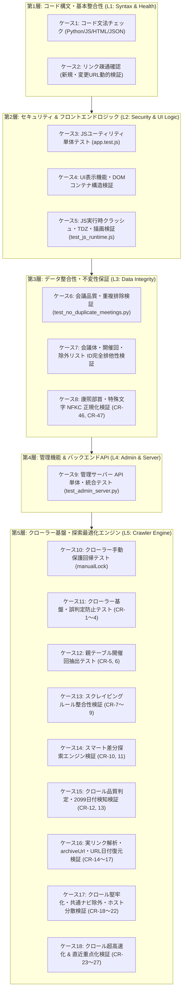

# PMHub 統合テストスイート仕様書 (`testing/run_test_suite.py`)

本ドキュメントは、政策会議ウォッチ（PMHub）の統合テストスイート [`testing/run_test_suite.py`](file:///d:/dev/PMHub/testing/run_test_suite.py) における全18テストケースの検証内容、妥当性評価、および将来に向けた効率化提案を体系的にまとめた技術仕様書です。

---

## 1. 統合テストスイートの設計思想

PMHub は全21省庁および内閣官房・内閣府の政策会議（1,448会議体・16,517開催回・93,050配付資料）を網羅する準リアルタイム・オープンデータプラットフォームです。  
行政サイトの度重なるリニューアル、文字コード混在（Shift_JIS / UTF-8）、特殊文字（康煕部首）、アクセス遮断（WAF）といった行政データ特有の課題に対応するため、単なる単体テストや生死確認（Smoke Test）にとどまらず、**「構文」「データ完全性」「セキュリティ」「UI描画」「クローラー基盤」を多層的に保証する品質ゲート**として設計されています。

---

## 2. 全18テストケースの詳細解説

| ケース番号 | テストケース名 | 対象ファイル / スクリプト | 検証内容と合否判定基準 |
|:---:|:---|:---|:---|
| **ケース 1** | **コード文法エラー (SyntaxError) 自動検証** | `check_syntax_errors` | プロジェクト内の主要 24 ファイル（Python, JS, HTML, JSON）の文法を検証。 ・Python: `ast.parse` による構文解析 ・JS: `node --check` による厳格構文検証 ・HTML: `DivBalanceChecker` による `
` タグ開閉・ネスト深度・underflow 検証およびインライン `<script>` の構文検証 ・JSON: `json.load` による構文破壊検証 |
| **ケース 2** | **新規・変更 URL リンク疎通確認** | `check_link_health` | `git diff` から追加・変更された URL を動的に抽出して疎通検証。 ・同一ドメイン 0.35秒レートリミット遵守 ・24時間有効のローカルキャッシュ（`.url_cache.json`）による重複アクセス防止 ・Akamai / Cloudflare 等の WAF 保護（403/401）許容判定 ・`--skip-network` オプション指定時は安全にスキップ |
| **ケース 3** | **JS ユーティリティ単体テスト** | `testing/app.test.js` | Node.js 標準テストランナー（`node --test`）を使用し、フロントエンドのコア関数 51 件を検証（バックグラウンド先行並行実行）。 ・`escapeHtml`: XSS 攻撃文字のエスケープ処理 ・`sanitizeUrl`: `javascript:` スキーム等の悪意あるリンク遮断 ・`formatDate`, `getFiscalYear`: 和暦・西暦・年度変換の正確性 ・`normalizeForSearch`: 検索クエリの全角半角・部首異体字正規化 |
| **ケース 4** | **UI 表示機能・DOM コンテナ構造検証** | `check_view_rendering` | 公開ポータルおよび管理コンソールの DOM 整合性を静的検証。 ・公開ポータル: 主要描画先（`timelineFeed`, `councilsAccordionList`, `dateRangeSelect`）の存在 ・管理ダッシュボード: 全5タブ（`tab-crawler`, `tab-meetings` 等）および各リスト描画コンテナの存在 |
| **ケース 5** | **JavaScript 実行時クラッシュ・TDZ・描画検証** | `testing/test_js_runtime.js` | JSDOM 仮想ブラウザ環境で `docs/app.js` を実際に実行・検証（バックグラウンド先行並行実行）。 ・初期ロード時の TDZ（Temporal Dead Zone）例外ゼロ ・タイムライン描画、アコーディオン描画時の未定義参照クラッシュゼロ ・管理コンソールの全5タブ切り替え描画時のクラッシュゼロ |
| **ケース 6** | **会議品質・回次整合性・重複排除検証** | `testing/test_no_duplicate_meetings.py` | `docs/data.json` 内の全 16,517 開催回を走査し、以下を検証（インプロセス実行 & 共有キャッシュ利用）。 ・開催回IDの完全重複 0件 ・同一会議体内の同一タイトル・同一日付重複 0件 ・日付フォーマット（`YYYY/MM/DD`）の適正性 ・開催回次（`round`）の数値整合性 ・クローラー一時データ・ゴミ文字列混入のゼロ化 |
| **ケース 7** | **会議体・タイムライン・除外リスト ID完全排他性検証** | `check_council_timeline_sync` | 会議体と開催回、および却下リストの整合性を検証（共有キャッシュ利用）。 ・会議体ID形式: `{省庁}-{スラグ}`（厳格 1 ハイフン・2セグメント） ・開催回ID形式: `{省庁}-{スラグ}-{日付}-{回次}`（厳格 3 ハイフン・4セグメント） ・親会議体が存在しない孤立開催回の検出 ・公開データ（`COUNCILS`）と却下リスト（`admin/rejected_councils.json`）の完全排他性 |
| **ケース 8** | **康煕部首・特殊文字 NFKC 正規化検証 (CR-46, 47)** | `testing/test_drop22_normalization.py` | 文字コード正規化パイプラインを検証（共有キャッシュ利用）。 ・CR-46: 康煕部首（`U+2F00`〜`U+2FD5`）および CJK 部首補助の通常漢字置換、全角英数・記号の NFKC 自動正規化 ・CR-47: `docs/data.json` 内に未処理の康煕部首が 0件であることの不変性検証、ID不変性検証 |
| **ケース 9** | **管理サーバー API 単体・統合テスト** | `testing/test_admin_server.py` | 管理サーバー（`admin/server.py`）の全 11 エンドポイントを検証（インプロセス実行）。 ・会議体一覧取得、開催回取得、手動ロック設定、ステータス更新等の API 疎通および入出力整合性 |
| **ケース 10** | **クローラー手動保護回帰テスト** | `testing/test_crawler_regression.py` | 手動修正データの保護機能（`manualLock: true`）の非破壊性を検証（インプロセス実行）。 ・手動登録された開催回・資料がクローラー再実行で上書き・削除されないこと ・手動データとクローラー自動検知データの安全なマージ処理 |
| **ケース 11** | **クローラー基盤・誤判定防止テスト (CR-1〜4)** | `testing/test_crawler_foundation.py` | クローラーのパーサー基盤を単体検証。 ・CR-1: スキップリンク（「本文へ移動」等）の配付資料誤登録防止 ・CR-2: 開催回の最新優先ソートおよび最大探索制限 ・CR-4: ジェネリック見出し（「目次」「ホーム」等）の開催回タイトル除外 |
| **ケース 12** | **親テーブル開催回抽出テスト (CR-5, 6)** | `testing/test_crawler_parent_table.py` | テーブル構造行政ページのパーサーを単体検証。 ・CR-5: 親ページ内 `<table>` からの開催回・配付資料抽出 ・CR-6: 親テーブルデータと個別サブページデータの自動同期連携 |
| **ケース 13** | **スクレイピングルール整合性検証 (CR-7〜9)** | `testing/test_scraping_rules_reorg.py` | クロールルールのマスター整合性を検証（共有キャッシュ利用）。 ・CR-7: 参照先のない孤立ルールの完全削除（0件） ・CR-8: 共通テンプレート継承の完全性 ・CR-9: 全 1,448 会議体に対する 100% ルール適用（未設定ゼロ） |
| **ケース 14** | **スマート差分探索エンジン検証 (CR-10, 11)** | `testing/test_crawler_incremental.py` | 増分巡回（Incremental Crawl）エンジンを検証。 ・CR-10: 既登録過去回の探索スキップ & 直近最新1〜2回のみの更新確認 ・CR-11: 未登録開催回の最大50件差分巡回 |
| **ケース 15** | **クロール品質判定・2099日付検知検証 (CR-12, 13)** | `testing/test_crawler_quality.py` | 成否判定エンジンおよび日付品質を検証。 ・CR-12: `determine_crawl_result` による成否判定精緻化と理由記録 ・CR-13: 開催日未確定プレースホルダー（`2099/01/01`）の自動検知と要確認集計 |
| **ケース 16** | **実リンク解析・archiveUrl・URL日付復元検証 (CR-14〜17)** | `testing/test_crawler_quality_v2.py` | 深層探索およびアーカイブ連携を検証。 ・CR-14: 親ページ実リンク解析型サブページ探索 ・CR-15: 2段階目URL（`archiveUrl`）を起点とした階層探索 ・CR-16: URL文字列からの開催日復元ロジック ・CR-17: ポータル目次・ガイドラインページの除外 |
| **ケース 17** | **クロール堅牢化・共通ナビ除外・ホスト分散検証 (CR-18〜22)** | `testing/test_crawler_drop16.py` | 耐障害性とデータ純度を検証。 ・CR-18: Windows 環境下の stdout 安全保護（Errno 22 根減） ・CR-19: ヘッダー・フッター・共通ナビリンクの除外 ・CR-20: 組織常設資料（名簿・設置要綱等）の開催回誤登録防止 ・CR-21: ホスト名分散インターリーブ巡回 |
| **ケース 18** | **クロール超高速化 & 直近重点化検証 (CR-23〜27)** | `testing/test_crawler_speedup.py` | 高速化と中断耐性を検証。 ・CR-23: 直近2年以内アクティブ会議体の重点化 & 休眠スキップ ・CR-24: 過去回再検査の完全ゼロ化 ・CR-25: 廃止会議体（`isClosed: true`）の巡回除外 ・CR-26: 同一ホスト並行レートリミット制御 ・CR-27: クロール途中停止時の即時安全保存（中断耐性） |

---

## 3. テストケースの妥当性評価

### 3-1. 多層防御構造の妥当性
本テストスイートは、以下の 5 層ピラミッド構造により **「コードの不具合」と「データの破損・劣化」の両面を相互補完的** に検査しています。
1. **構文層 (L1)**: コミット前に文法エラー・HTMLタグ破損・JSON破損を未然に排除。
2. **ロジック層 (L2)**: セキュリティ関数（XSSサニタイズ）と UI 描画（TDZ防止）を保証。
3. **データ層 (L3)**: 会議体・開催回マスターの重複ゼロ、ID命名規則、文字正規化（康煕部首0件）の不変性を担保。
4. **管理層 (L4)**: 管理サーバーの API エンドポイントの疎通を担保。
5. **クローラー層 (L5)**: 探索・抽出・判定の各サブシステム（Drop 10〜22 で実装された機能群）の回帰を完全防止。

### 3-2. テストケース間の重複と独立性の評価
- **ケース 3 と ケース 5 の住み分け**:
  - ケース 3 は個々の純粋関数のユニットテスト（Node.js test runner）。
  - ケース 5 は JSDOM を用いた UI 全体の統合レンダリング・クラッシュ検証。
  - 単体テストと統合描画テストの役割分担が確立されています。
- **ケース 6 と ケース 7 の住み分け**:
  - ケース 6 は「開催回データ（`meetings`）の重複・回次・日付フォーマット」を走査。
  - ケース 7 は「会議体マスター（`councils`）のIDフォーマット・却下リスト（`rejected`）との排他性」を走査。
  - 両者は対象データと検査目的が明確に分かれており、重複ではなく相互補完的です。
- **ケース 10〜18 のクローラーテスト群の住み分け**:
  - 各テストは、Drop 10（基盤）、Drop 11（親テーブル）、Drop 12（ルール）、Drop 13（差分巡回）、Drop 14（品質判定）、Drop 15（深層探索）、Drop 16（ノイズ除外）、Drop 17（高速化）という**機能改善ごとの回帰防止テスト**として綺麗にモジュール分離されています。

---

## 4. 効率化・高速化の実装と今後の提案

### 実装済みの高速化施策（適用完了）
1. **インプロセス実行化によるサブプロセス起動オーバーヘッド削減**:
   - `test_no_duplicate_meetings.py`、`test_crawler_regression.py`、`test_admin_server.py` を同一 Python プロセス内で直接呼び出し。プロセス起動コスト（約 1.2 秒）を削減。
2. **`data.json` のオンメモリ・キャッシュ共有**:
   - セッション開始時に1度だけメモリに読み込み（`get_shared_data()`）、ケース 6, 7, 8, 13 へオンメモリ辞書を共有。13MB の JSON パース（約 1.2 秒）を削減。
3. **Node.js テストの非同期先行並行実行**:
   - `ThreadPoolExecutor` を活用し、L1 完了直後にバックグラウンドで `app.test.js` と `test_js_runtime.js` を並行起動。コンソール出力順序を維持しつつ待機時間を隠蔽。

### 今後の効率化提案
- **提案: 実行カテゴリセレクター（CLI オプション）の導入**:
  - 開発作業のコンテキストに応じたフィルタリングオプションの追加：
    - `python testing/run_test_suite.py --data-only`（データ整合性・ID・文字正規化のみ実行）
    - `python testing/run_test_suite.py --ui-only`（構文・JS単体・UI描画のみ実行）
    - `python testing/run_test_suite.py --crawler-only`（クローラー関連テストのみ実行）
    - デフォルト（オプションなし）は従来どおり **全18ケースをフル実行**（コミット・マージ前の品質ゲート）。

---

## 5. まとめ

`testing/run_test_suite.py` は、全18ケースにわたって明確な役割分担を持ち、無駄な重複なく多層的に PMHub の品質を担保しています。  
階層順（L1〜L5）の再編とインプロセス化・キャッシュ共有・並行実行により、堅牢性を一切犠牲にすることなく高速かつ直感的な検証パイプラインが構築されています。
